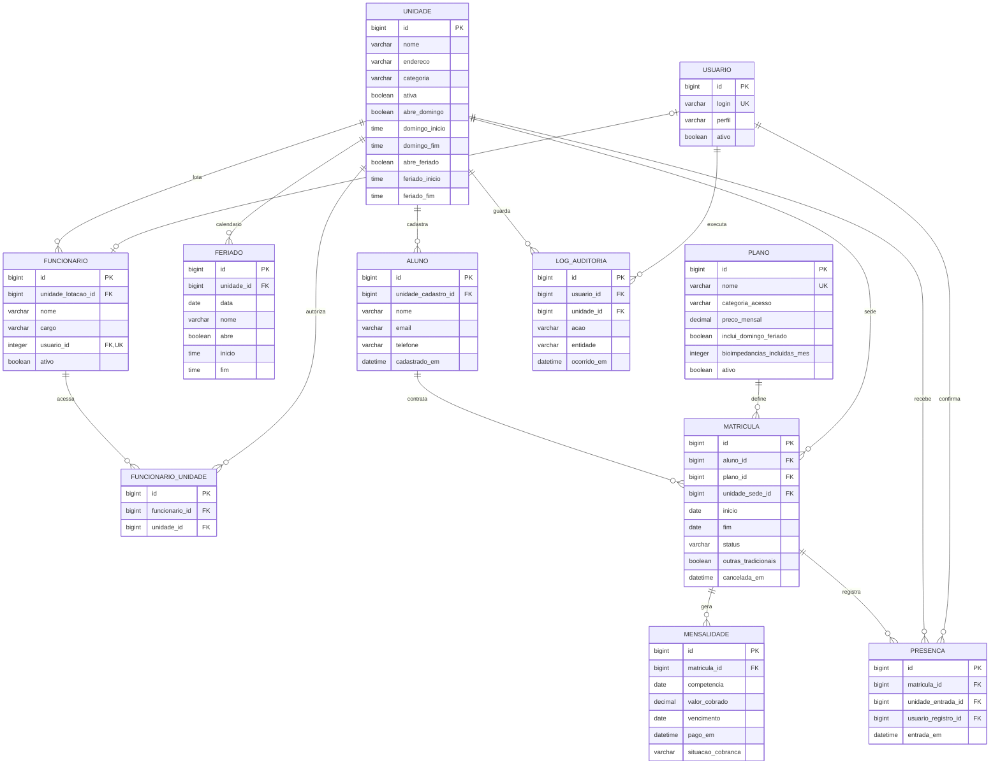

# GymInsight — DER da gestão da academia

Versão de planejamento. Categorias, feriados e acesso de gerentes a mais de uma unidade já foram implementados; catálogo global de planos, mensalidades por competência e presença em outra unidade ainda não representam o banco atual. `PK` é chave primária, `FK` é chave estrangeira e `UK` indica unicidade.

## Catálogo dos três planos

| Plano | Mensalidade | Categorias de unidade acessíveis | Condição de acesso | Benefícios previstos |
| --- | ---: | --- | --- | --- |
| Tradicional | R$ 100,00 | Tradicional | Unidade sede; outras unidades Tradicionais **somente** se o contrato permitir | Musculação, cardio básico e aulas básicas da unidade; suporte digital descrito no plano. |
| Premium | R$ 150,00 | Premium e Tradicional | Unidade sede e demais unidades dessas categorias | Musculação, cardio e grade coletiva ampliada conforme a unidade. |
| Diamante | R$ 200,00 | Diamante, Premium e Tradicional | Todas as unidades ativas; domingo e feriado onde houver funcionamento | Estrutura de alto padrão; benefício contratual de uma bioimpedância por mês. |

`PLANO` é um catálogo da rede, sem `unidade_id`: o mesmo plano pode ser vendido em diferentes unidades. `UNIDADE.categoria` assume **TRADICIONAL, PREMIUM ou DIAMANTE**. Toda matrícula escolhe uma unidade sede compatível com a categoria do plano. `MATRICULA.outras_tradicionais` registra a cláusula específica do contrato Tradicional; para os demais planos não altera o acesso. Preço contratado é copiado para cada `MENSALIDADE.valor_cobrado`, preservando cobranças antigas se o catálogo mudar de preço.

O suporte digital e a bioimpedância aparecem **apenas como benefícios comerciais do plano**. Este DER não contém aplicativo de treinos, ficha, avaliação física, medições, IMC ou atendimento ao aluno.

## Matrículas, mensalidades e faturamento

- Um aluno pode ter várias matrículas no histórico, mas **no máximo uma ativa por vez**. A matrícula aponta ao aluno, ao plano escolhido e à unidade sede. Status: **ATIVA, ENCERRADA, CANCELADA**.
- No modelo implementado, cada matrícula gera uma cobrança pelo período contratado, com competência do mês de início; renovar cria outra matrícula. O par `(matricula_id, competencia)` é único. Cada cobrança guarda seu valor e vencimento, independentemente do preço vigente do plano. Situação registrada: **PENDENTE, PAGA ou CANCELADA**; a cobrança **ATRASADA** é uma pendente cujo vencimento passou e que não foi paga.
- Para o módulo de alunos matriculados, apresentar aluno, plano, sede, status da matrícula e situação financeira: **em dia** quando não houver cobrança vencida pendente; **em atraso** quando houver ao menos uma; **matrícula cancelada** quando `MATRICULA.status = CANCELADA`. A ausência de cobranças não comprova pagamento: deve aparecer como **sem mensalidade emitida**.
- Cancelar a matrícula impede novas mensalidades, mas não cancela automaticamente valores já devidos; o cancelamento de cada cobrança é explícito. **Faturamento recebido** soma mensalidades pagas pelo `pago_em`; **valores em aberto** somam cobranças pendentes. Agrupar por unidade sede e período permite relatórios gerenciais.
- `PRESENCA` conserva o controle operacional de entradas. A entrada registra a unidade em que ocorreu e somente é aceita se a matrícula estiver válida e seu plano der acesso à categoria dessa unidade. A existência de mensalidade atrasada é exibida à equipe; eventual bloqueio de acesso por inadimplência ainda depende de regra contratual.

## Funcionários e acesso

`FUNCIONARIO` registra a lotação e o cargo de qualquer empregado. Somente funcionários ativos com cargo GERENTE ou ATENDENTE e conta em grupo correspondente têm login no sistema; outros cargos permanecem como cadastros administrativos. `FUNCIONARIO_UNIDADE` delimita as unidades visíveis a cada operador, inclusive gerentes responsáveis por mais de uma unidade. O atendente administra matrículas, alunos e cobranças conforme suas permissões; o gerente consulta o faturamento e gerencia funcionários, planos e unidades. Registros e relatórios sempre são limitados às unidades autorizadas.

Não se presume quantidade fixa de unidades na rede: o plano Diamante cobre todas as unidades cadastradas e ativas que operem na data, sem codificar o número citado na descrição comercial.
