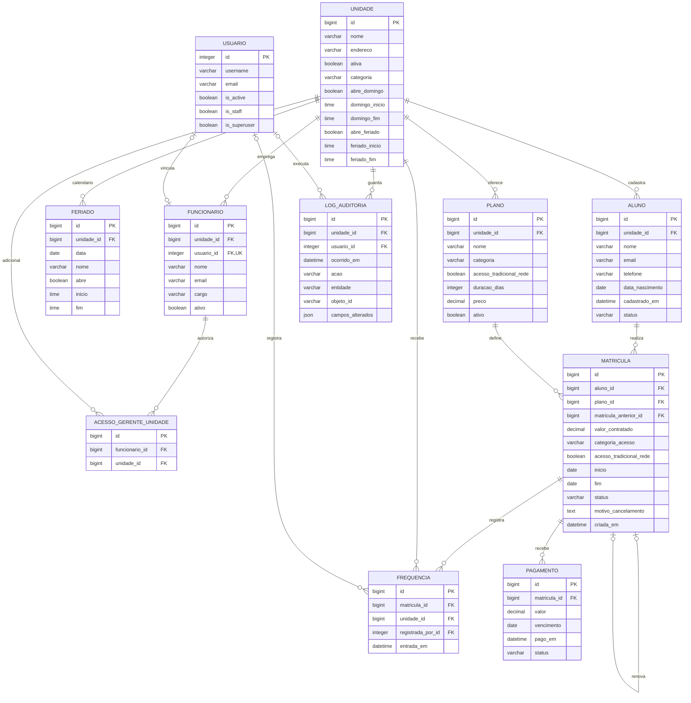

# DER — GymInsight

Diagrama entidade relacionamento baseado em `backend/core/models.py` e nas migrações `0001` a `0009`. `USUARIO` representa o modelo padrão `auth.User` do Django. As colunas marcadas com `PK` são chaves primárias e as marcadas com `FK` são chaves estrangeiras.

## Como ler as relações

| Relação | Regra |
| --- | --- |
| Unidade → aluno, plano, funcionário e log | Cada registro filho pertence a exatamente uma unidade; uma unidade pode ter zero ou muitos registros. |
| Funcionário → unidades adicionais | O gerente possui uma unidade de lotação e pode receber acesso adicional a outras unidades; o atendente permanece limitado à unidade de lotação. |
| Unidade → feriado | Uma unidade tem datas especiais próprias. Cada data pode usar o horário padrão de feriado ou uma exceção de abertura/fechamento. |
| Usuário → funcionário | Uma conta pode estar vinculada a zero ou um funcionário; somente gerente e atendente ativos com conta e grupo compatível entram no sistema. Professores e faxineiros ficam cadastrados sem login. |
| Aluno → matrícula | Cada matrícula pertence a um aluno; um aluno pode ter muitas matrículas ao longo do tempo. O banco admite zero matrículas, mas o cadastro pela API cria a primeira matrícula junto com o aluno. |
| Plano → matrícula | Cada matrícula aponta para um plano; um plano pode ser contratado por vários alunos. |
| Matrícula → frequência e pagamento | Cada entrada e pagamento aponta para uma matrícula; a matrícula pode ter zero ou muitos de cada tipo. |
| Usuário → frequência e log | O operador pode ficar nulo nesses registros quando o usuário é removido ou, no caso do log, quando a operação não informa um usuário. |

## Restrições e campos que merecem atenção

- `FERIADO`: o par `(unidade_id, data)` é único. Feriado registrado tem prioridade sobre o horário de domingo; dia comum usa o estado ativo da unidade.
- `UNIDADE`: categoria Tradicional, Premium ou Diamante. Horários de abertura e fechamento são obrigatórios se abrir no domingo ou feriado; dias comuns ainda não têm horário cadastrado.
- `PLANO`: `(unidade_id, nome)` é único; categoria e acesso Tradicional em rede determinam as unidades permitidas. A matrícula preserva esses direitos contratados em campos próprios.
- `FREQUENCIA.unidade_id` identifica a unidade da entrada; é opcional no esquema por compatibilidade com registros legados, mas a API sempre o preenche.
- `MATRICULA`: há uma restrição de unicidade parcial para `aluno_id` **somente quando `status = ativa`**. Assim, cada aluno tem no máximo uma matrícula ativa no banco; matrículas antigas encerradas ou canceladas permanecem.
- `MATRICULA.aluno_id` e `MATRICULA.plano_id` precisam apontar para registros da mesma unidade. Essa correspondência é verificada por validação e serviços, não por chave estrangeira composta no banco.
- `LOG_AUDITORIA.entidade` e `objeto_id` identificam o objeto auditado por texto; **não são chaves estrangeiras** para as tabelas auditadas. O log guarda nomes de campos alterados, sem os valores anteriores ou novos.
- A exclusão da maioria das relações usa `PROTECT`; `FUNCIONARIO.usuario_id` e as demais relações opcionais com `USUARIO` usam `SET_NULL`.

## Autenticação e permissões do Django

O controle de acesso também usa tabelas padrão do Django: `auth_group`, `auth_permission`, `django_content_type` e as tabelas de associação `auth_user_groups`, `auth_user_user_permissions` e `auth_group_permissions`. São relacionamentos muitos para muitos entre usuários, grupos e permissões. Estão resumidos aqui para manter o DER principal legível; o esquema exato dessas tabelas segue as migrações instaladas do Django.

O [DER de gestão proposto](DER-GESTAO-PROPOSTO.md) ainda difere da implementação quanto ao catálogo central dos três planos, à matrícula com unidade sede e às mensalidades por competência.
